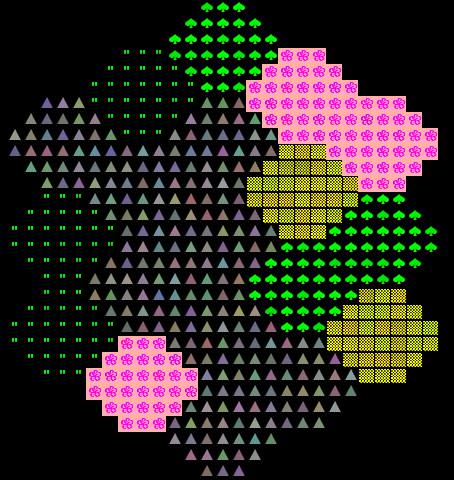
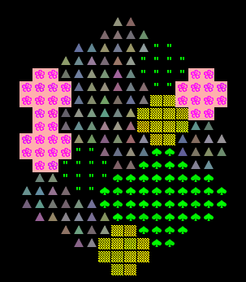

# HexWorld
`HexWorld.java` is a random terrain generator that will build hexagon based worlds. As an example, the world below contains fields of grass, fields of flowers, desert, forests, and mountains.

It can support differently sized hexagons and draw a tesselation of hexagons. (See below)

size-3 hexagon

size-2 hexagon

## Class: HexWorld
This is where the main logic of the program. It takes in arguments from the command line and based on the command calls the corresponding command.
### Fields
`WIDTH`: the width of the canvas (x-axis).
`HEIGHT`: the height of the canvas (y-axis).
`SEED`: this pseudorandomly creates the HexWorld.
### Major Methods
1. `drawRow`: draw a row of tiles to board, anchored at a given position
2. `drawHex`: draw hexagon starting at position p,using the given tile pattern.
3. `drawHexCol`: adds a column of n hexagons, each of whose biomes are chosen randomly to the world at position p. Each of the hexagons are of size s.
4. `drawWorld`: pseudorandomly generates a hexWorld.

## TileEngine 

This class mainly supports the generator to render a world. The code to generate a world consists of three main parts:
1. initialize the tile rendering engine.
2. generate a two dimensional `TETile[][]` array.
3. Use the tile rendering engine to display the `TETile[][]` array.

* This class is provided.
## TETile
This object is the single tile in the world. A 2D array of tiles make up a board, and can be drawn to the screen using the TERenderer class.
It has character, color, description.

* This class is provided.